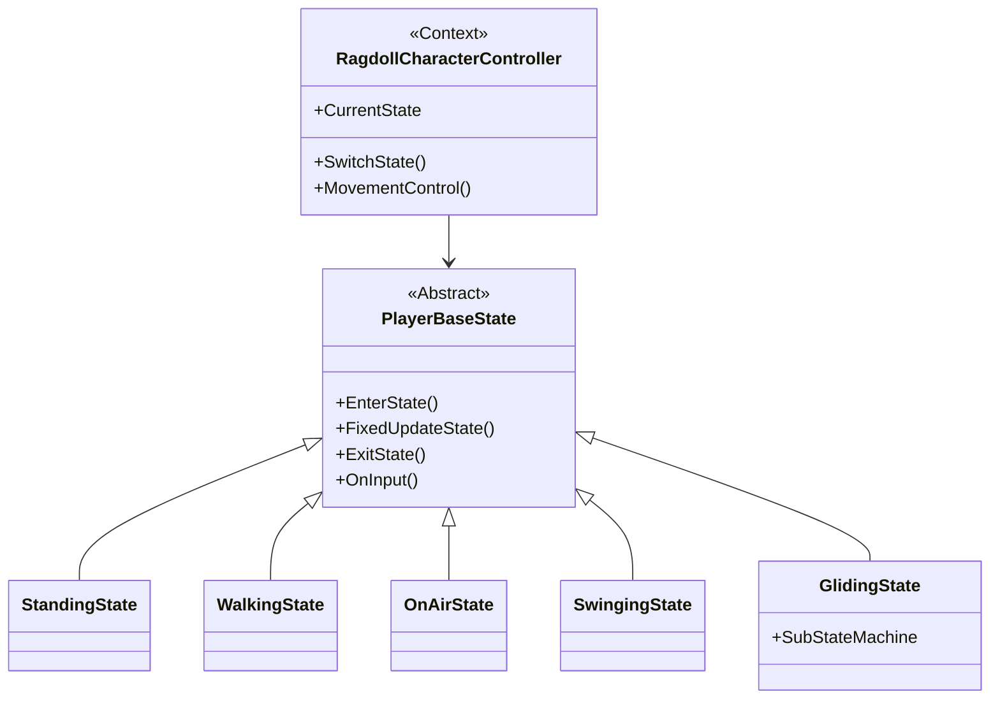
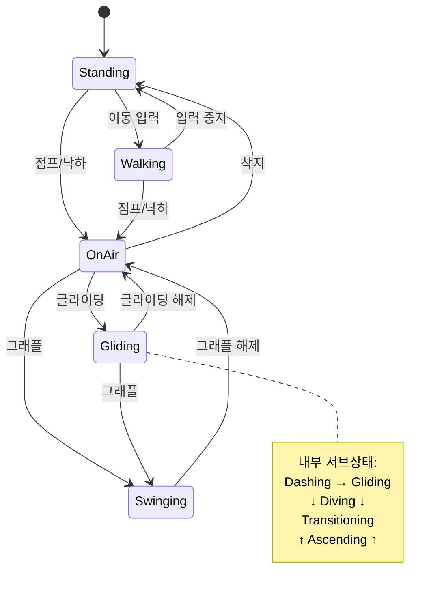

# RagdollCharacterController 아키텍처

## State Pattern을 활용한 플레이어 상태 관리 시스템

---

## 시스템 구조



---

## 상태 전환 흐름



---

## 핵심 구성 요소

### 1. Context (RagdollCharacterController)
**역할**: 상태 관리 및 공통 기능 제공
- 현재 상태 보유 및 전환
- 입력을 현재 상태에 위임
- 물리 이동, 회전, 모멘텀 계산 등 공통 메서드 제공

### 2. State (PlayerBaseState)
**역할**: 모든 상태의 추상 기반 클래스
- `EnterState()`: 상태 진입 시 초기화
- `FixedUpdateState()`: 매 프레임 물리 업데이트
- `ExitState()`: 상태 종료 시 정리
- `OnInput()`: 입력 이벤트 처리

### 3. Concrete States (구체적 상태)

| 상태 | 역할 | 주요 동작 |
|------|------|-----------|
| **Standing** | 정지 상태 | 호버링, 입력 대기 |
| **Walking** | 지상 이동 | 지면 이동 제어, 브레이크 |
| **OnAir** | 공중 상태 | 제한적 공중 제어, 중력 적용 |
| **Swinging** | 그래플 스윙 | 좌우 그래플 관리, 로프 물리 |
| **Gliding** | 글라이딩 | 5개 서브상태로 복잡한 비행 제어 |

---

## GlidingState 서브 상태 머신

```
Dashing (초기 대시)
    ↓
Gliding (일반 글라이딩) ←→ Diving (다이빙)
    ↕                        ↓
Ascending (급상승)    Transitioning (전환)
```

**각 서브상태 역할**:
- **Dashing**: 진입 시 초기 가속
- **Gliding**: 입력 방향으로 활강
- **Diving**: 입력 없이 급강하
- **Transitioning**: Diving → Gliding 부드러운 전환
- **Ascending**: 점프로 급상승

---

## 주요 메커니즘

### 모멘텀 시스템
```
고속 이동 → 모멘텀 축적 → 최대 속도 증가
지상 상태에서 빠르게 감소
```

### 상태 전환 규칙
```
각 상태는 독립적으로 전환 조건 판단
SwitchState() 호출 → ExitState() → EnterState() 자동 실행
```

### 입력 위임 패턴
```
Controller가 입력 수신
    ↓
CurrentState의 OnInput() 호출
    ↓
상태별로 다르게 해석 (예: Jump → Standing에서는 점프, Swinging에서는 Reeling)
```

---

## 설계 장점

- **확장성**: 새 상태 추가 시 기존 코드 수정 불필요
- **유지보수성**: 각 상태가 독립적으로 관리됨
- **가독성**: 상태별 로직이 명확히 분리됨
- **유연성**: 런타임에 동적으로 상태 전환
